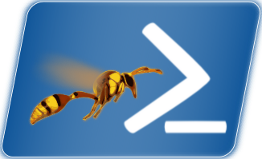

# The Original UI Automation Module for PowerShell

WASP is a wrapper over the [Windows Automation API](https://docs.microsoft.com/en-us/windows/win32/winauto/windows-automation-api-overview) which is part of Windows' modern Accessibility features.
This version is an update of my WASP module to use Microsoft's UI Automation 3.0 via the [TestStack/UIAComWrapper](https://github.com/TestStack/UIAComWrapper). Most of the PowerShell code is generated at build time -- but some parts (particularly the two "Input" commands, and Select-UIElement) are hand-crafted.

The resulting module loads faster, and has more capabilities than the old WASP 2.x, but you've found it when it's quite not ready yet.

The parts that _are_ here do all seem to work, but please feel free to play around with the code generation and let me know if anything seems to be missing or broken. I always welcome suggestions or requests, and I'm happy to have additional contributors.

## To build

You need [ModuleBuilder](/PoshCode/ModuleBuilder), but you have to run `build.ps1` to generate the code (you'll see a bunch of files show up in Public\Generated), and then it will run `Build-Module` for you. Once you've generated the ps1 files once, you can work from that if you want.